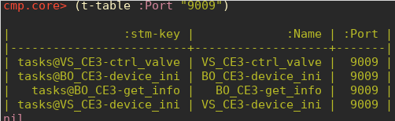

# Documentation

* [API](./api)
* [coverage](./coverage)
* [namespaces](./graph.png)

# Installation

## Leiningen on Ubuntu

```shell
sudo apt install leiningen
```

##  Leiningen on openSUSE (LEAP 15)

```shell
zypper ar https://download.opensuse.org/repositories/devel:/languages:/clojure/openSUSE_Leap_15.1/devel:languages:clojure.repo
zypper ref devel_languages_clojure
zypper in  leiningen
```

## cmp from git repo

```shell
git clone https://github.com/wactbprot/cmp.git
cd cmp
lein deps
lein repl ## output should look like this:
```

```clojure
;;  nREPL server started on port 41649 on host 127.0.0.1 - nrepl://127.0.0.1:41649
;;  REPL-y 0.4.3, nREPL 0.6.0
;;  Clojure 1.10.1
;;  OpenJDK 64-Bit Server VM 11.0.7+10-post-Ubuntu-2ubuntu219.10
;;      Docs: (doc function-name-here)
;;            (find-doc "part-of-name-here")
;;    Source: (source function-name-here)
;;   Javadoc: (javadoc java-object-or-class-here)
;;      Exit: Control+D or (exit) or (quit)
;;   Results: Stored in vars *1, *2, *3, an exception in *e
 
;;  cmp.core=> (doc t-run)
;;  -------------------------
;;  cmp.core/t-run
;;  ([name] [name mp-id struct i j k])
;;    Runs the task with the given name (from stm).
;;    If only the name is provided, results are stored
;;    under  `core@test@0@response@0@0`.
;;  
;;    If  `mp-id`, `struct`, `i`, `j` and  `k` is given,
;;    the results are written to `<mp-id@<struct>@<i>@response@<j>@<k>`.
;;    A listener at this key triggers a `callback` which de-registers
;;    and closes the listener. The callback also gets the value of 
;;    the key (`<mp-id@<struct>@<i>@response@<j>@<k>`) and pretty
;;    prints it.
;;    
;;    Example:
;;    ```clojure
;;    (t-run "DKM_PPC4_DMM-read_temp")
;;    ;;
;;    ;; {:t_start 1588071759882,
;;    ;; :t_stop 1588071768996,
;;    ;; :Result
;;    ;; [{:Type dkmppc4,
;;    ;;  :Value 24.297828639,
;;    ;;  :Unit C,
;;    ;;  :SdValue 0.0013625169107,
;;    ;;  :N 10}]}
;;    ```
;;  
;;    Debug
;;    ```clojure
;;    @st/listeners
;;    (st/de-register! "core" "test" 0 "response")
;;    ```
;;    
;;  nil
;;  cmp.core=> 

```

# Usage

User interaction with **cmp** is **REPL only**. The `core`
namespace is the entry point. Use `(dir cmp.core)` to get an
overview. Commands in `(ns cmp.core)` have the following prefixes:

* `t-` ... **tasks**
- `t-build (cmp.core) <f>`
- `t-build-edn (cmp.core) <f>`
- `t-clear (cmp.core) <f>`
- `t-refresh (cmp.core) <f>`

* `m-` ... **mpd**
- `m-build (cmp.core) <f>`
- `m-build-edn (cmp.core) <f>`
- `m-clear (cmp.core) <f>`
- `m-info (cmp.core) <f>`
- `m-start (cmp.core) <f>`
- `m-stop (cmp.core) <f>`

* `d-` ... **documents**
- `d-add (cmp.core) <f>`
- `d-ids (cmp.core) <f>`
- `d-rm (cmp.core) <f>`

* `c-` ... **container**
- `c-reset (cmp.core) <f>`
- `c-run (cmp.core) <f>`
- `c-status (cmp.core) <f>`
- `c-stop (cmp.core) <f> `
- `c-suspend (cmp.core) <f>`

* `n-` ... **definitions**
- `n-status (cmp.core) <f>`


## reference mpd

Find a documented reference measurement program definition (`mpd`) in
[edn-format](https://github.com/edn-format/edn) at
[mpd-ref.edn](./mpd-ref.edn). 


Build `mpd` provided by *cmp* in `edn`-format with:

```clojure
(m-build-edn)
```

## tasks

Build or refresh tasks with:

```clojure
(t-refresh)
```

Build `tasks` provided by *cmp* in `edn`-format with:

```clojure
(t-build-edn)
```

`(t-table)` overview of all tasks loaded in short term memory.
The table may be filtered:




## start mpd

```clojure
(workon! "ref")
(m-start)
```

## run container

Run the first *container* with:

```clojure
(c-run 0)
;; same as:
(ctrl 0 "run")
```

## go on

Use the build-in `(doc x)` function (e.g. `(doc t-build)`) for further
details.

```clojure
(doc t-build)
-------------------------
cmp.core/t-build
([])
  Builds the `tasks` endpoint. At
  runtime all `tasks` are provided by
  `st-mem`
```

Use the build-in `(dir cmp.core)` function to get a list of all
functions in this namespace.

## documents

To add or rm documents for storing data in use `(d-add mp-id doc-id)`,
`(d-rm mp-id doc-id)`.  If `(->mp-id)` is set (by `(workon mp-id)`)
`(d-add doc-id)`, `(d-rm doc-id)` is sufficient.

```clojure
(d-add "cal-2020-se3-kk-11111_0002")
;; hiob DEBUG [cmp.lt-mem:14] - try to get document
;;             with id: cal-2020-se3-kk-11111_0002
;; "OK"
(d-ids)
;; (cal-2020-se3-kk-11111_0001 cal-2020-se3-kk-11111_0002)
```

# Clojure

* [cheatsheet](https://clojure.org/api/cheatsheet)
* [clojure-style-guide](https://github.com/bbatsov/clojure-style-guide)
* [eastwood (linter)](https://github.com/jonase/eastwood)

# Redis

All of the `mp` state is kept in a [redis](https://redis.io) database.

## config

Since version 0.3.0 *cmp* relies on
[Keyspace Notifications](https://redis.io/topics/notifications).
Therefore it is necassary to replace in `/etc/redis/redis.conf`:

```shell
notify-keyspace-events ""
```

by

```shell
notify-keyspace-events AK
```

and restart the service:


```shell
# restart
$ sudo systemctl restart redis.service

# check state
$ sudo systemctl status redis.service
```

## redis gui

* [RedisDesktopManager](https://github.com/uglide/RedisDesktopManager)
  `sudo snap install redis-desktop-manager`
* [redis-commander](https://github.com/joeferner/redis-commander)

```shell
$ npm install -g redis-commander
## --> http://localhost:8081/
```

# devel

All devel commands have to be executed
in the root directory of *cmp*.

```shell
$ cd path/to/cmp
```

## documentation

(re)generate documentation

```shell
$ lein codox
```

## tests

```shell
$ lein test
```

### Run tests from REPL

Example `utils-tests`:

```clojure
(ns cmp.utils-test) 
(use 'clojure.test)
(run-tests)
```

## code coverage

```shell
$ lein cloverage
```

## ns-graph

```shell
$ lein ns-graph
```
